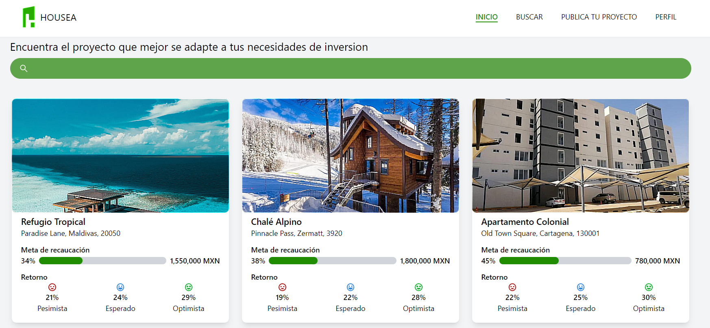

<h1 align="center"> IA-House-Prices-Campechaneado </h1> 
<div align="center">
  


</div>
<h2 align="center">
:construction: Proyecto en construcción :construction:
</h2>

Bienvenido al repositorio del proyecto de ventas de casas. Este proyecto tiene como objetivo crear una plataforma para la gestión de ventas de propiedades inmobiliarias, facilitando a los usuarios la búsqueda y compra de casas de manera eficiente.

## Índice

- [Carpetas](#carpetas)
- [Capturas de Pantalla](#capturas-de-pantalla)
- [Tecnologías Utilizadas](#tecnologías-utilizadas)
- [Requisitos Previos](#requisitos-previos)
- [Instalación](#instalación)
- [Configuración](#configuración)
- [Uso](#uso)
- [Contribuciones](#contribuciones)

## Carpetas

- `Movil`: Aplicación Móvil.
    - `campechanenado_movil_app`: Proyecto.
- `be-house-p`: Backend.
- `fe-house-p`: Frontend.
- `house-prices-advanced-regression-techniques`: Ejercicio en clase.
- `modelos`: Módelo de análisis.

## Capturas de Pantalla

 
*Página principal de la aplicación, donde podras encontrar*


*Descripción de la captura de pantalla 2.*

## Tecnologías Utilizadas

- Frontend: Next.JS, MUI, Flutter, Vercel.
- Backend: Aws.
- Base de Datos: 
- Otras herramientas: Git para control de versiones.

## Requisitos previos

- Python 3.8+
- Librerías:
    - Numpy
    - Pandas
    - Scikit-learn

## Instalación

1. Clonar el repositorio:
   ```bash
   git clone https://github.com/alexfne/IA_concentracion.git
   
2. Numpy:
   ```bash
   pip install numpy
   
4. Pandas:
   ```bash
   pip install pandas
   
5. Scikit-learn:
   ```bash
   pip install scikit-learn
   
6. Navega al directorio del proyecto: `cd ventas-de-casas`
7. Instala las dependencias del backend: `npm install`
8. Navega a la carpeta del frontend: `cd frontend`
9. Instala las dependencias del frontend: `npm install`

## Configuración

- Configura la base de datos en `backend/config/database.js`.
- Configura las variables de entorno en un archivo `.env` para mantener la información sensible segura.

## Uso

1. Inicia el servidor backend
   - Asegurate de tener los archivos en el mismo directorio `app.py` y `arbol.joblib`.
2. Inicia la aplicación frontend: `npm run start` en el directorio `frontend`.
3. Abre tu navegador y visita: `https://www.housea.systems/`.
   - Haz una vista general con la cuenta administrador 


## Contribuciones

¡Las contribuciones son bienvenidas! Si encuentras algún error o tienes alguna mejora, siéntete libre de abrir un problema o enviar una solicitud de extracción.
