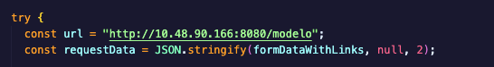

<h1 align="center"> fe-house-p </h1> 
<div align="center">
  


</div>


## Índice

- [Requisitos Previos](#requisitos-previos)
- [Configuración](#configuración)
- [Uso](#uso)
- [Contribuciones](#contribuciones)

## Requisitos previos

- Asegurate de tener el back funcionando
   

## Configuración

 

Recuerda configurar la IP correspondioente de tu computadora.

```bash
   try{
        const url = "IPLocal/modelo";
        const requestData = JSON.stringify(formDataWithLinks, null, 2);
   }
```

Si la nueva IP es 127.0.0.1 es la que se ocuparía en lugar de *IPLocal*.

## Uso

1. Inicia el servidor backend: `python app.py` en el directorio `be-house-p`.
2. Inicia la aplicación frontend: haz los cambios necesarios para la IP en el directorio `fe-house-p`.
3. Abre tu navegador y visita: `https://www.housea.systems/`.

## Contribuciones

¡Las contribuciones son bienvenidas! Si encuentras algún error o tienes alguna mejora, siéntete libre de abrir un problema o enviar una solicitud de extracción.

